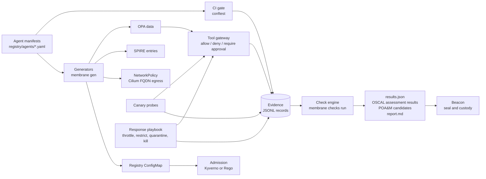

# membrane

Membrane is a reference for AI agent containment. Each gate prevents an action and records its decision as evidence. You do not collect evidence as a separate task.

A cell does not track every molecule inside it. It controls what crosses its membrane. Membrane applies the same model to AI agents. It does not try to watch the model. It controls the boundaries that every agent must cross: identity, the tool gateway, the network, and the deploy pipeline.

Membrane is a reference, not a product. Read [LIMITS.md](LIMITS.md) before you use any part of it.

## How it works



1. **One manifest per agent is the source of truth.** It holds the tier, tools, egress, approvals, evals, AI-BOM, and sandbox settings. See [schema/agent-manifest.v1.schema.json](schema/agent-manifest.v1.schema.json).
2. **The CI gate enforces tier rules** before merge. A tier 3 agent with an irreversible tool must require approval. A tier 4 agent must run in an isolated sandbox with no standing credentials.
3. **Generators build all enforcement config from the manifests:** OPA data, SPIRE registration entries, a per-agent egress NetworkPolicy, a namespace-wide egress default-deny for every agent namespace, Cilium FQDN egress policy, and the registry ConfigMap. `membrane gen --check` fails when the committed config differs from the manifests.
4. **Admission control** rejects agent pods that are not registered, whose manifest hash differs, or whose image is not pinned by digest.
5. **The tool gateway asks OPA on every call.** The answer is allow, deny, or require approval. An approval token is bound to the hash of one exact action and works once. Every decision becomes an evidence record with a trace id.
6. **Canary probes** try forbidden actions on a schedule. Each denial is a record that the gateway path denied that action. The canary tests only the gateway path. Its egress probes do not run without a cluster, and the run lists them as not run.
7. **The response playbook** throttles, restricts, quarantines, or kills an agent. The kill drill measures the time from the decision to the first denial.
8. **The check engine** reads the evidence and gives each check PASS, FAIL, NO_EVIDENCE, STALE, or INELIGIBLE. It rolls each control up to MET, PARTIAL, or NOT MET, and writes OSCAL assessment results.
9. **Beacon seals the results.** Membrane does not do custody. The Beacon plugin is in [integrations/beacon/](integrations/beacon/).

## Agent tiers

Containment follows capability, as biosafety levels follow the hazard.

| Tier | What the agent can do | Minimum controls the CI gate enforces |
| --- | --- | --- |
| 1 | Read internal data | Pinned model and image, read-only scopes, no egress |
| 2 | Write to internal systems | Evals at 0.90 or more, AI-BOM, rate limit on each tool |
| 3 | Take external or irreversible actions | Evals at 0.95 or more, approval for irreversible actions, a named human delegator, FQDN-only egress |
| 4 | Run code, or act with privilege | Evals at 0.97 or more, isolated sandbox, no standing credentials, session recording, red team record, two promotion approvers who are not the owner |

## Quick start

You need Python 3.11 or later, and [OPA](https://www.openpolicyagent.org/) and [conftest](https://www.conftest.dev/) on your PATH. The Kyverno CLI is optional.

```sh
pip install -e '.[dev]'
make test        # Rego, conftest, Kyverno, and Python tests
make demo        # end-to-end run with a local gateway
```

`make demo` runs [scripts/demo.sh](scripts/demo.sh). It validates the manifests, checks for drift, starts the gateway, sends agent traffic, runs the canary, runs a kill drill, and runs the checks. The report is `out/assessment/report.md`.

The demo passes `--allow-nonlive`. It mixes live gateway evidence with fixture cluster evidence, because a laptop has no cluster. The report says so in a banner. A demo report is not an assessment. The fixtures contain planted problems, so five checks FAIL on purpose: an unregistered workload, a drifted manifest hash, a model API key outside the vault, an egress flow to a destination not in the manifest, and a deploy that skipped evals.

## Commands

| Command | What it does |
| --- | --- |
| `membrane validate` | Validate every manifest against the schema |
| `membrane gen [--check]` | Generate enforcement config. `--check` fails on drift |
| `membrane gateway serve` | Run the reference tool gateway on 127.0.0.1:8750 |
| `membrane identity issue <agent>` | Print a dev identity token (not SPIFFE) |
| `membrane approve <approval_id> --approver <email> [--confirm-action-sha256 <hex>]` | Show one pending action (agent, tool, resource, delegator, args, action hash). Sign an approval only with `--confirm-action-sha256` equal to the shown hash |
| `membrane canary run` | Run the negative tests against the gateway |
| `membrane respond <agent> --step <step>` | Throttle, restrict, quarantine, kill, or restore an agent |
| `membrane drill kill <agent>` | Measure time from kill decision to denial |
| `membrane checks run` | Evaluate the checks and write the assessment output |
| `membrane checks doc` | Write docs/CONTROLS.md from the check catalog |

## Checks

Eleven checks cover inventory, identity, audit, approvals, delegation, egress, change control, negative tests, and incident response. [docs/CONTROLS.md](docs/CONTROLS.md) lists each check with its NIST SP 800-53 Rev 5 controls and SCF 2026.3 assessment objectives. The SCF ids come only from the Beacon pin. The mapping is membrane's own judgment. No assessor has reviewed it.

## Repository map

| Path | What |
| --- | --- |
| `registry/agents/` | Example manifests for five agents, tier 1 to 4, and a canary |
| `schema/` | Manifest, evidence record, and decision log schemas. Vendored OSCAL schema |
| `policy/` | CI, runtime, and admission policies with tests. See [policy/README.md](policy/README.md) |
| `membrane/` | Python package: generators, gateway, canary, response, checks |
| `out/generated/` | Generated enforcement config. Committed so that drift shows in review |
| `controls/checks.yaml` | Check catalog and control mapping |
| `fixtures/evidence/` | Fixture cluster evidence for the demo |
| `integrations/beacon/` | Beacon drop-in plugin |
| `docs/` | [Contracts](docs/CONTRACTS.md), [architecture](docs/ARCHITECTURE.md), [controls](docs/CONTROLS.md), [sources](docs/SOURCES.md) |

## Status words

Membrane uses PASS, FAIL, NO_EVIDENCE, STALE, and INELIGIBLE for checks. It uses MET, PARTIAL, and NOT MET for controls. A control status is a rollup of automated checks. It is not an assessor determination, and it does not cover the whole control.
