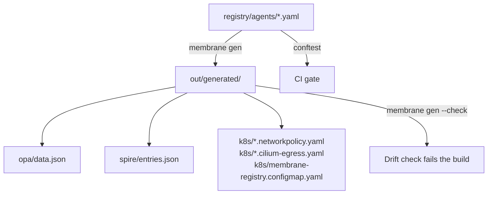
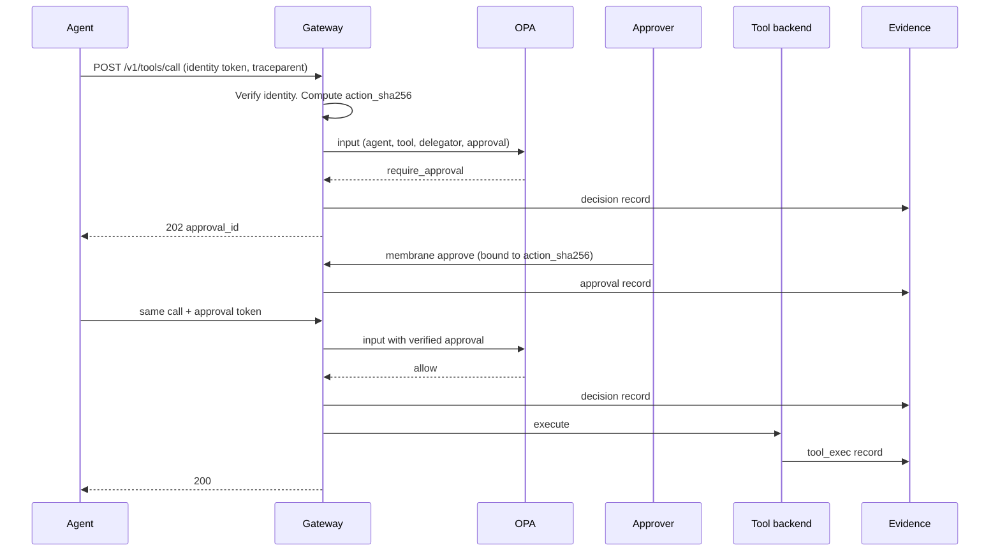
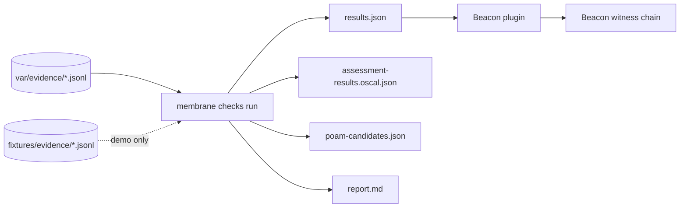

# Architecture

## Principle

Prevention and evidence are the same event. Each gate makes a decision and writes a record of that decision. The record is the evidence. So each gate is also a sensor.

Membrane does not watch what a model thinks. It controls the boundaries that an agent must cross:

| Boundary | Gate | What it stops | Record it writes |
| --- | --- | --- | --- |
| Source control | CI gate (`policy/ci`) | A manifest that breaks its tier rules | `pipeline_run` |
| Deploy | Admission (`policy/admission`) | Unregistered pods, hash drift, unpinned images | Kubernetes audit log (outside membrane) |
| Identity | SPIRE entries (`out/generated/spire`) | Credentials for an unregistered workload | SPIRE logs (outside membrane) |
| Tool call | Gateway + OPA (`policy/runtime`) | Tools outside the manifest, missing delegator, unapproved irreversible actions | `decision`, `approval`, `tool_exec` |
| Network | NetworkPolicy + Cilium (`out/generated/k8s`) | Egress to destinations not in the manifest | `egress_flow` (from Hubble or a proxy) |

## One source of truth

The generated files are committed. A reviewer sees each change to enforcement in the pull request. `membrane gen --check` fails CI when a person edits a generated file by hand, or when a manifest changes and nobody regenerated the output.

## Tool call sequence

The approval token names one action hash. A token for action A cannot approve action B. The policy denies a mismatched approval with `approval_mismatch`. It does not open a new approval request, so a replay cannot turn into a fresh request that a person approves by habit.

## Response steps

| Step | Effect at the gateway | External action (dry run in the reference) |
| --- | --- | --- |
| throttle | Rate limit halves | None |
| restrict | Every tool needs approval | None |
| quarantine | Every call is denied | Label pods `membrane.io/quarantine=true`. The quarantine NetworkPolicy blocks all traffic |
| kill | Every call is denied | Scale to zero. Delete the SPIRE entry. Revoke tokens |
| restore | Back to the previous state | Undo the above |

The overrides file is read on each request. A step takes effect at the next call. The kill drill measures that time and compares it with the SLA.

## Evidence to assessment

The engine checks each record's payload hash and record hash when it reads it. The record hash covers the envelope (`mode`, `collected_at`, `kind`, `agent_id`, `source`, `id`). The same record id with different content in two evidence dirs also stops the run. A bad hash stops the run with exit code 2. A record with mode `fixture` or `simulated` counts only when the run passes `--allow-nonlive`. That run is marked as a demonstration everywhere it writes.

## Contracts

[CONTRACTS.md](CONTRACTS.md) defines every interface: the OPA input and output, the decision rules in order, each evidence payload, the identity token format, the check status words, and the CLI.
